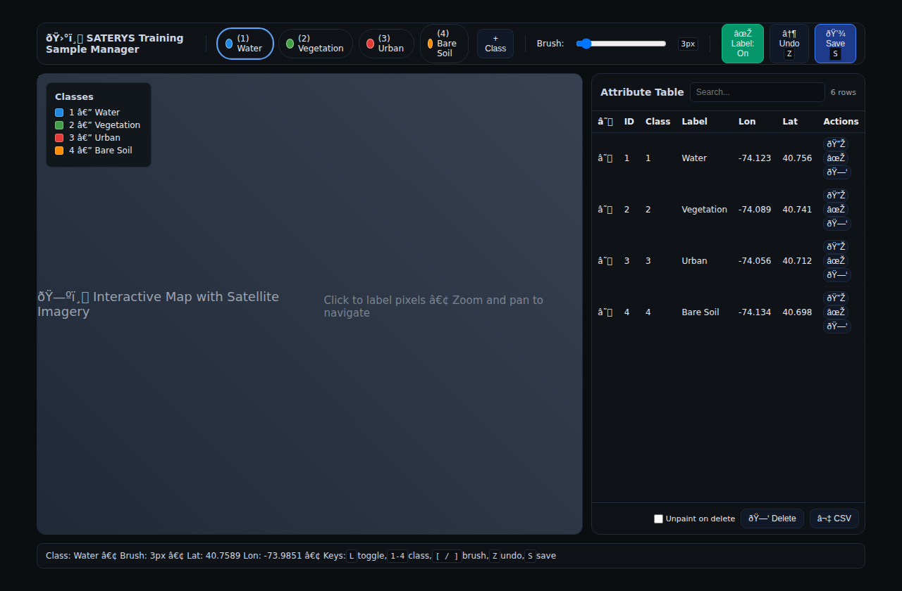

# 🎯 Manual Labeler: Interactive Training Sample Manager

The SATERYS Manual Labeler is a powerful interactive tool for creating training samples by manually labeling pixels on satellite imagery. This comprehensive guide will walk you through every aspect of using this tool effectively.

## 🌟 Overview

The Manual Labeler provides a professional web-based interface for:
- **Interactive pixel labeling** with configurable brush sizes
- **Class management** with customizable colors and names
- **Attribute table** for browsing, editing, and managing labeled points
- **Real-time visualization** on interactive maps with multiple basemap options
- **Export capabilities** to standard geospatial formats (GPKG, Shapefile, CSV)



---

## 🚀 Quick Start

### Prerequisites

Before using the Manual Labeler, ensure you have:
- A raster image (GeoTIFF, COG, or other GDAL-supported format)
- SATERYS installed with required dependencies

### Basic Usage

1. **Add the Manual Labeler node** to your SATERYS pipeline
2. **Configure the input raster** path
3. **Set up your classification classes**
4. **Execute the node** to launch the web interface
5. **Start labeling** your training samples

---

## 🔧 Node Configuration

### Required Parameters

```python
# Basic configuration
{
    "input_path": "path/to/your/raster.tif",           # Input raster file
    "class_raster_path": "./results/labels.tif",      # Output label raster
    "points_path": "./results/training_points.gpkg"   # Output vector points
}
```

### Class Definition

Configure your classification scheme:

```python
{
    "classes": [
        {"id": 1, "name": "Water", "color": "#1E88E5"},
        {"id": 2, "name": "Vegetation", "color": "#43A047"},
        {"id": 3, "name": "Urban", "color": "#E53935"},
        {"id": 4, "name": "Bare Soil", "color": "#FB8C00"},
        {"id": 5, "name": "Forest", "color": "#2E7D32"}
    ]
}
```

### Advanced Options

```python
{
    "brush_size_px": 3,                    # Painting brush size in pixels
    "host": "127.0.0.1",                   # Server host address
    "port": 8090,                          # Server port
    "open_browser": True,                  # Auto-open browser
    "persist_classes": True,               # Save class definitions
    "classes_path": "./results/classes.json"  # Class definitions file
}
```

---

## 📱 User Interface Guide

### Main Interface Components

The Manual Labeler interface consists of several key areas:

```
┌─────────────────────────────────────────────────────────────┐
│  🛰️ SATERYS Training Sample Manager            [Controls]  │
├─────────────────────────────────────────────────────────────┤
│ [Water] [Vegetation] [Urban] [+Class] │ Brush: ●●● │ Tools │
├──────────────────────────────────────┼────────────┼───────┤
│                                      │            │ 🗺️    │
│              MAP AREA                │ ATTRIBUTE  │ MAP   │
│        (Interactive Leaflet          │   TABLE    │       │
│         with your raster)            │            │ 🗺️    │
│                                      │            │       │
├──────────────────────────────────────┴────────────┴───────┤
│ Class: Water • Brush: 3px • Lat: 40.123 Lon: -74.567     │
└─────────────────────────────────────────────────────────────┘
```

### 1. Top Toolbar

**Brand & Navigation**
- SATERYS branding and current tool identification

**Class Palette**
- Color-coded class chips showing ID, name, and color
- Click to select active class for labeling
- ✎ Edit button for modifying class properties

**Controls**
- **+ Class**: Add new classification classes
- **Brush slider**: Adjust painting brush size (1-31 pixels)
- **✎ Label toggle**: Enable/disable labeling mode
- **↶ Undo**: Undo last labeling operations
- **💾 Save**: Export current labels to files

### 2. Map Area

**Interactive Map Features**
- **Basemap options**: Satellite imagery, OpenStreetMap
- **Raster overlay**: Your input imagery with opacity control
- **Zoom & pan**: Standard map navigation controls
- **Crosshair cursor**: When in labeling mode
- **Point visualization**: Colored markers for labeled pixels

**Labeling Controls**
- **Click to label**: Paint pixels with selected class
- **Mouse tracking**: Real-time coordinate display
- **Visual feedback**: Immediate point placement visualization

### 3. Attribute Table Panel

**Table Management**
- **Search functionality**: Filter by ID, class, coordinates, or name
- **Sortable columns**: Click headers to sort data
- **Row selection**: Checkboxes for bulk operations
- **Row count display**: Shows current filtered results

**Row Actions**
- **🔎 Go-to**: Pan map to point location with highlight
- **✎ Edit**: Change class assignment for individual points
- **🗑 Delete**: Remove points with optional unpaint

**Bulk Operations**
- **Select all**: Master checkbox for all visible rows
- **Delete selected**: Remove multiple points at once
- **Unpaint option**: Remove pixels from raster when deleting
- **⬇ CSV Export**: Download table as comma-separated values

### 4. Status Bar

Real-time display of:
- **Current class**: Active class for labeling
- **Brush size**: Current brush diameter
- **Coordinates**: Live mouse position (lat/lon)
- **Keyboard shortcuts**: Quick reference guide

---

## 🎨 Step-by-Step Tutorial

### Step 1: Setting Up Your First Labeling Session

1. **Prepare Your Data**
   ```bash
   # Ensure your raster is in a supported format
   gdalinfo your_image.tif
   ```

2. **Configure the Node**
   - Set `input_path` to your raster file
   - Define your classification classes
   - Choose output paths for results

3. **Launch the Interface**
   - Execute the node in SATERYS
   - Wait for the web interface to open
   - Verify your raster loads correctly

### Step 2: Understanding the Interface

4. **Explore the Map**
   - Use zoom controls to navigate your imagery
   - Switch between basemap options
   - Adjust raster overlay opacity if needed

5. **Review Class Definitions**
   - Check the color-coded class palette
   - Verify class names and colors are appropriate
   - Note the current selection (highlighted chip)

### Step 3: Creating Your First Labels

6. **Enable Labeling Mode**
   ```
   Method 1: Click "✎ Label: Off" button → becomes "✎ Label: On"
   Method 2: Press 'L' key to toggle
   ```

7. **Select a Class**
   ```
   Method 1: Click on a class chip in the palette
   Method 2: Press number keys (1-9) for classes with those IDs
   ```

8. **Start Labeling**
   - Notice the crosshair cursor appears
   - Click on pixels to paint them with the selected class
   - Watch points appear immediately on the map

### Step 4: Managing Classes

9. **Add New Classes**
   - Click **"+ Class"** button
   - Enter class name (e.g., "Cloud")
   - Set color (auto-generated or custom)
   - Specify ID (auto-assigned or custom)

10. **Edit Existing Classes**
    - Click ✎ button on any class chip
    - Modify name, color, or ID
    - **Note**: Changing ID will recode all existing pixels

11. **Remove Classes**
    - Use the class edit dialog
    - Confirm removal of unwanted classes

### Step 5: Advanced Labeling Techniques

12. **Adjust Brush Size**
    ```
    Method 1: Use the brush slider (1-31 pixels)
    Method 2: Use [ and ] keys to decrease/increase
    ```

13. **Efficient Labeling Workflow**
    - Start with larger brush for homogeneous areas
    - Use smaller brush for boundaries and details
    - Label representative samples, not exhaustive coverage

14. **Use Keyboard Shortcuts**
    ```
    L     - Toggle labeling mode
    1-9   - Select class by ID
    [ ]   - Adjust brush size
    Z     - Undo last operation
    S     - Save current labels
    ```

### Step 6: Working with the Attribute Table

15. **Browse Your Labels**
    - Review all labeled points in the table
    - Use search to find specific entries
    - Sort by any column for better organization

16. **Navigate to Points**
    - Click 🔎 to zoom to any point
    - Map highlights the selected point briefly

17. **Edit Individual Points**
    - Click ✎ to change class assignment
    - Enter new class ID when prompted

18. **Bulk Operations**
    - Select multiple rows using checkboxes
    - Delete selected points
    - Choose whether to unpaint pixels

### Step 7: Quality Control and Review

19. **Review Your Work**
    - Toggle labeling mode off for cleaner view
    - Zoom to different areas to check coverage
    - Verify class assignments are correct

20. **Use Undo Functionality**
    - Press 'Z' or click ↶ to undo mistakes
    - Multiple undos are supported
    - Both points and pixels are reverted

21. **Correct Errors**
    - Re-label misclassified pixels
    - Delete incorrect points via attribute table
    - Add missing samples for underrepresented classes

### Step 8: Exporting Your Training Data

22. **Save Your Work**
    ```
    Method 1: Click "💾 Save" button
    Method 2: Press 'S' key
    ```

23. **Export Options**
    - **GPKG/Shapefile**: Vector points with class attributes
    - **GeoTIFF**: Raster with class pixels (uint8)
    - **CSV**: Tabular data with coordinates and classes

24. **Verify Outputs**
    ```bash
    # Check vector output
    ogrinfo results/training_points.gpkg
    
    # Check raster output  
    gdalinfo results/labels.tif
    ```

---

## ⌨️ Keyboard Shortcuts Reference

| Key | Action | Description |
|-----|--------|-------------|
| `L` | Toggle Label Mode | Switch between navigation and labeling |
| `1-9` | Select Class | Choose class by ID number |
| `[` | Decrease Brush | Make brush smaller |
| `]` | Increase Brush | Make brush larger |
| `Z` | Undo | Revert last labeling operation |
| `S` | Save | Export current labels to files |

---

## 📊 Output Data Formats

### Vector Points (GPKG/Shapefile)

```
Point Geometry + Attributes:
├── class_id (integer)    - Numeric class identifier
├── class_name (string)   - Human-readable class name
└── coordinates           - Geographic location (EPSG:4326)
```

### Raster Labels (GeoTIFF)

```
Single-band uint8 raster:
├── 0: Unlabeled pixels
├── 1-255: Class IDs
├── Same projection as input
└── Same spatial extent as input
```

### CSV Export

```csv
id,lon,lat,class_id,class_name
1,-74.123456,40.654321,1,Water
2,-74.234567,40.765432,2,Vegetation
...
```

---

## 🔧 Advanced Configuration

### Custom Tile Server

If you have your own tile server for the base raster:

```python
{
    "raster_tile_url_template": "https://your-server.com/tiles/{z}/{x}/{y}.png"
}
```

### Performance Tuning

For large datasets:

```python
{
    "brush_size_px": 1,        # Smaller brush for precision
    "port_autoselect": True,   # Auto-find available port
    "max_port_scans": 20      # Try more ports if needed
}
```

### Persistence Settings

```python
{
    "persist_classes": True,                    # Save class definitions
    "classes_path": "./config/classes.json"    # Custom classes file
}
```

---

## 🐛 Troubleshooting

### Common Issues

**Issue: "Raster file not found"**
```bash
# Solution: Check file path and permissions
ls -la /path/to/your/raster.tif
gdalinfo /path/to/your/raster.tif
```

**Issue: "Port already in use"**
```python
# Solution: Use auto-port selection or specify different port
{
    "port": 8091,              # Try different port
    "port_autoselect": True    # Let system choose
}
```

**Issue: "Map not loading"**
- Check internet connection for basemap tiles
- Verify raster has proper spatial reference
- Ensure GDAL can read the raster format

**Issue: "Labels not saving"**
```bash
# Solution: Check output directory permissions
mkdir -p results
chmod 755 results
```

### Performance Tips

1. **Use appropriate brush sizes**
   - Large brushes for homogeneous areas
   - Small brushes for detailed boundaries

2. **Label efficiently**
   - Focus on representative samples
   - Don't over-label similar areas

3. **Save frequently**
   - Use Ctrl+S or the save button regularly
   - Avoid losing work due to browser issues

---

## 🌐 Integration with SATERYS Workflows

### Upstream Connections

The Manual Labeler accepts raster inputs from:
- `raster.input` nodes
- `raster.ndvi`, `raster.ndwi` calculation results
- Any node outputting raster data

### Downstream Usage

Manual Labeler outputs can feed into:
- Machine learning training nodes
- Classification accuracy assessment
- Statistical analysis workflows

### Example Pipeline

```
[Raster Input] → [Manual Labeler] → [ML Classifier] → [Accuracy Assessment]
       ↓              ↓                    ↓               ↓
   Raw Image    Training Labels      Classified Map    Validation
```

---

## 📈 Best Practices

### 1. Planning Your Labeling Strategy

**Before You Start:**
- Define clear class definitions
- Plan representative sampling locations
- Estimate required sample sizes per class

**Class Design:**
- Use distinctive, non-overlapping classes
- Choose intuitive names and colors
- Keep ID numbers consistent across sessions

### 2. Efficient Labeling Workflow

**Systematic Approach:**
- Label one class at a time across the image
- Start with easily identifiable classes
- Save frequently to avoid data loss

**Quality Over Quantity:**
- Focus on high-confidence labels
- Avoid labeling ambiguous pixels
- Review and correct mistakes regularly

### 3. Data Management

**File Organization:**
```
project/
├── data/
│   ├── raw_imagery.tif
│   └── preprocessed.tif
├── labels/
│   ├── session_1_labels.gpkg
│   ├── session_2_labels.gpkg
│   └── final_training_set.gpkg
└── config/
    └── classes.json
```

**Version Control:**
- Keep backup copies of important label sets
- Document labeling decisions and methodology
- Track class definition changes over time

---

## 🤝 Contributing and Feedback

The Manual Labeler is actively developed and we welcome:
- **Bug reports**: Issues with functionality
- **Feature requests**: New capabilities needed
- **Documentation improvements**: Clarity and completeness
- **Example datasets**: Sample data for testing

**Submit feedback via:**
- [GitHub Issues](https://github.com/bastian6666/SATERYS/issues)
- [Discussions](https://github.com/bastian6666/SATERYS/discussions)

---

## 📚 Related Documentation

- [Getting Started Guide](getting-started.md) - SATERYS basics
- [Plugin Development](plugins.md) - Creating custom nodes
- [API Reference](api.md) - REST endpoints
- [Examples](../examples/) - Sample workflows

---

<div align="center">

**Happy Labeling! 🎯🛰️**

*Creating high-quality training data for better machine learning models*

[⬅️ Back to Getting Started](getting-started.md) | [Examples ➡️](../examples/)

</div>